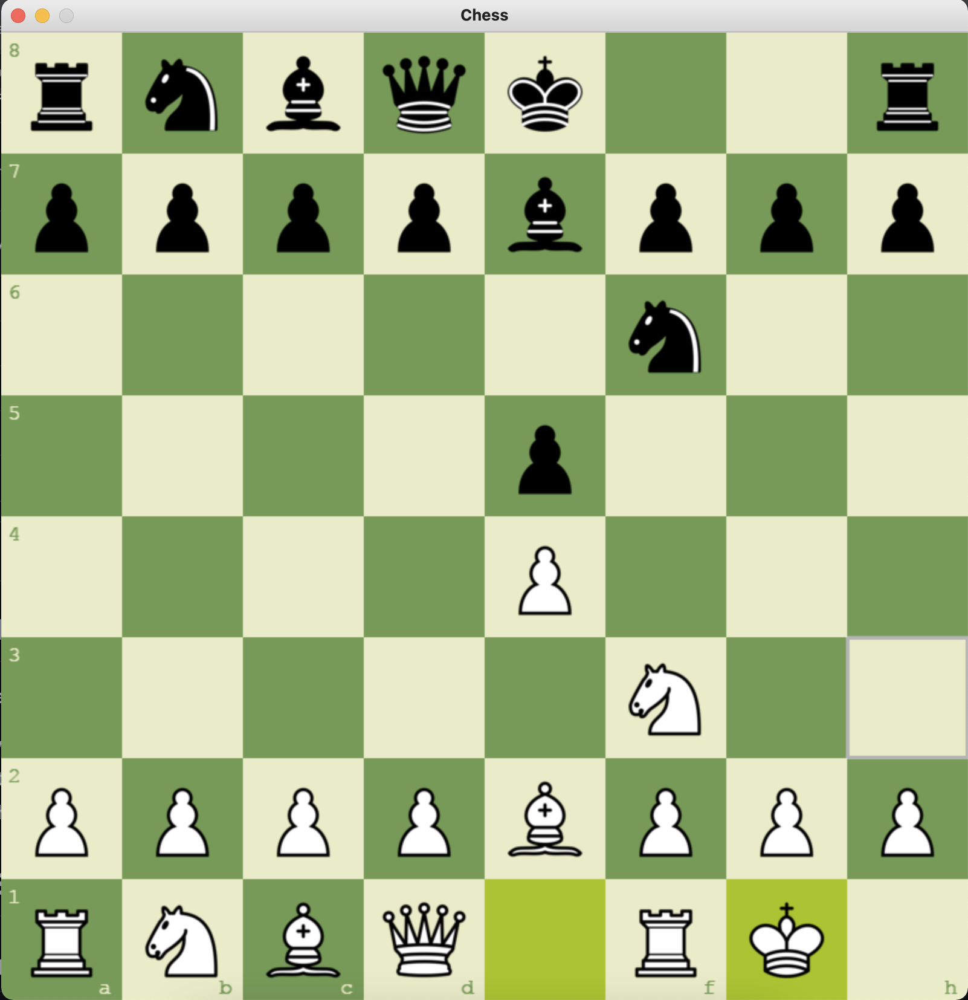

### ⚫Game Instructions:

#### Entry point: main.py
 #### 1.) Press 't' to change the theme (green, brown, blue, grey).
 #### 2.) Press 'r' to restart the game.

# Game Snapshots

## Snapshot 1 - Start (green)

## Snapshot 2 - Start (brown)

## Snapshot 3 - Start (blue)

## Snapshot 4 - Start (grey)

## Snapshot 5 - Valid Moves

## Snapshot 6 - Castling

### Have fun✌️! 
##### ©2022, Erik Shrestha
